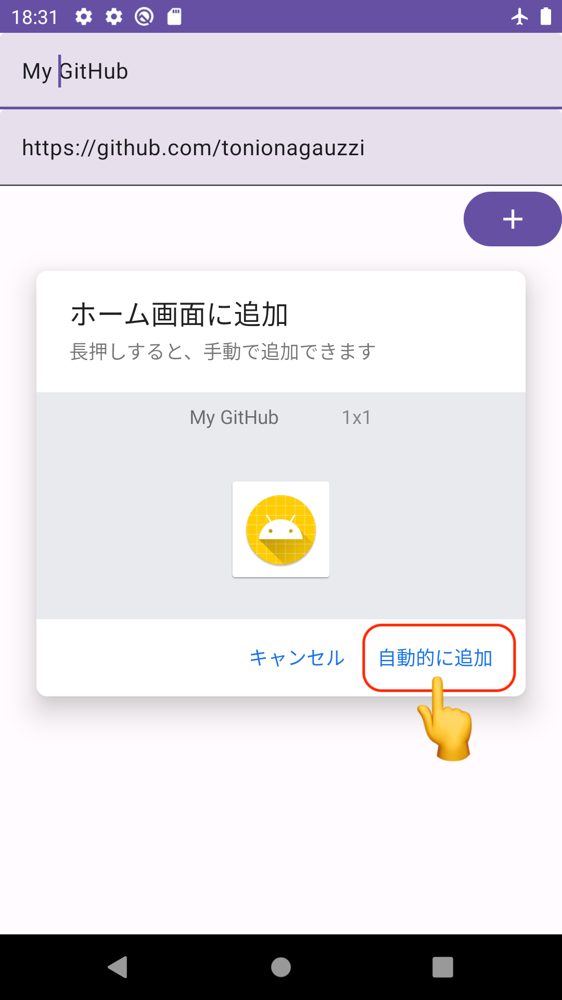

# Funpone

Funpone is a useful app to **open the URL that you always use with one click from the home screen**. 
Not only can it launch a browser, but it can also open various applications corresponding to the URL.

## How to use
### 1. Input the URL you want to open directly from the home screen, and then tap "+" icon.

### 2. Please follow the instructions to add the Pinned Shortcut to your home screen.

### 3. After completing the setup, please tap the Pinned Shortcut on the home screen.

### 4. You can open the URL with your usual app!!

